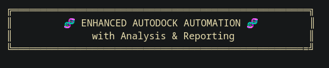

<p align="center">
  
</p>


# To automate the process
Copy these three files to the directory + smiles.txt(which should be you ligand as smiles) 
1. Let's start from here and save the smiles as a .pdb and .pdbqt and even with the edited .pdbqt for the docking automation in the prepared_ligands directory

```bash
chmod +x prepare_ligands.py
python3 prepare_ligands.py smiles.txt X Y Z
```

2. next run the dock all ligands.sh and see the result in the docking_result directory
```bash
chmod +x ./dock_all_ligands.sh
./dock_all_ligands
```

3. next run the extract_best_poses.sh for find the best poses and save them as .pdb in the best_poses directory
```bash
chmod +x ./extract_best_poses.sh
./extract_best_poses.sh
```
to dock for you 


</br></br>


We have two files in this repo 
1. prepare_ligands.py 

```bash
chmod +x prepare_ligands.py
python3 prepare_ligands.py smiles.txt X Y Z
```

2. automate_ligand_preparation.sh (not recommended)
```bash
chmod +x ./automate_ligand_preparation.sh
./automate_ligand_preparation.sh smiles.txt X Y Z
```
these 2 files is for ligand preparation
---

- don't forget to copy the receptor related files to the directory that you wanted

- save the smiles in the `smiles.txt`
    for example :
```txt
COC(=O)Nc1nc2cc(C(=O)c3ccccc3)ccc2[nH]1 mebendazole
CCCSc1ccc2[nH]c(NC(=O)OC)nc2c1 albendazole
O=C(Nc1ccc([N+](=O)[O-])cc1Cl)c1cc(Cl)ccc1O niclosamide
Smiles nameofthecompound
```

## change the .dpf and .gpf
- r.dpf should contains:
```txt
autodock_parameter_version 4.2
outlev 1
intelec
seed pid time
ligand_types A C HD N NA OA SA P S Cl F Br I
fld r.maps.fld
map r.A.map
map r.C.map
map r.HD.map
map r.N.map
map r.NA.map
map r.OA.map
map r.SA.map
map r.P.map
map r.S.map
map r.Cl.map
map r.F.map
map r.Br.map
map r.I.map
elecmap r.e.map
desolvmap r.d.map
move ligand.pdbqt
about 0 0 0
tran0 0 0 0
quat0 0 0 1
dihe0 0 0 0 0
torsdof <your torsional DOF here>
tstep 2.0
qstep 50.0
dstep 50.0
torsd 100.0
rmstol 2.0
extnrg 1000.0
e0max 0 10000
ga_pop_size 150
ga_num_evals 2500000
ga_num_generations 27000
ga_run 10
analysis
```

- r.gpf should contains:
```txt
npts 60 60 60        # number of grid points in x,y,z
spacing 0.375        # grid spacing (Angstroms)
gridcenter 0.0 0.0 0.0   # center of grid box (adjust to your binding site)
receptor_types A C HD N NA OA SA P S Cl F Br I
ligand_types   A C HD N NA OA SA P S Cl F Br I
receptor receptor.pdbqt
gridfld receptor.maps.fld
map r.A.map
map r.C.map
map r.HD.map
map r.N.map
map r.NA.map
map r.OA.map
map r.SA.map
map r.P.map
map r.S.map
map r.Cl.map
map r.F.map
map r.Br.map
map r.I.map
elecmap r.e.map
dsolvmap r.d.map
dielectric -0.1465
```
this repo will be updated soon 